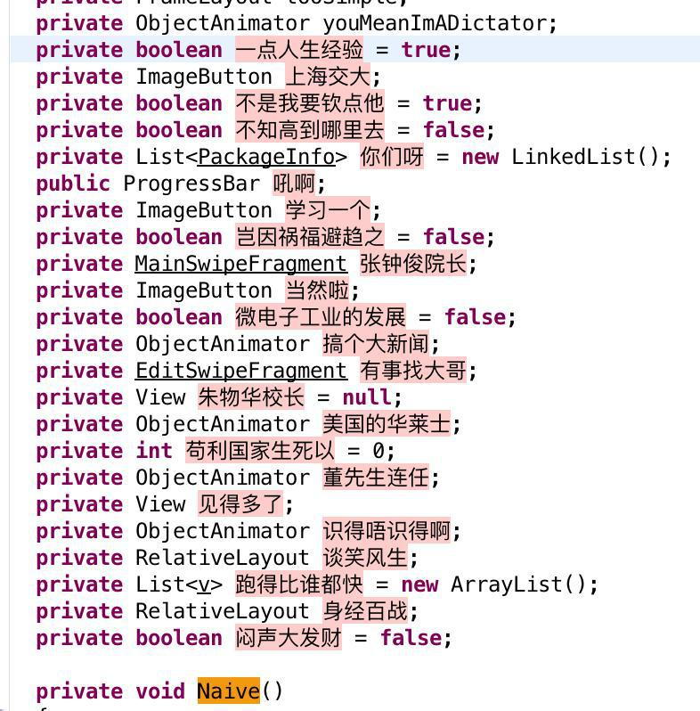

# Proguard Elder Dictionary

目前 baksmali 对 utf-8 字符的编码存在问题，因此使用中文作为字典可以略微提升二次打包的难度。

弊端在于会略微增加 apk 文件的体积。

## 使用方法

下载 txt 放入项目，并在对应的 proguard-rules.pro 里添加：

	-obfuscationdictionary dictionary-elder.txt

## 使用效果

## 协议

WTFPL